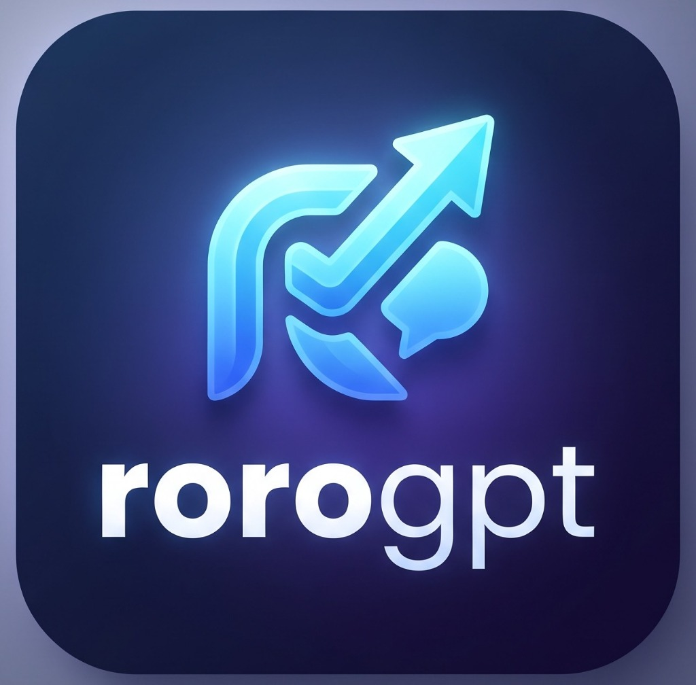

# 🌈 RoroGPT

> **A vibrant, colorful, and 100% free AI chat web application powered by ultra-fast free models (Groq LPUs, Google Gemini, Cerebras, and Local Ollama). Designed for seamless deployment on Vercel with local PC chat storage.**

[](https://vercel.com/new/clone?repository-url=https://github.com/roroleaks/rorogpt)
[](https://github.com/roroleaks/rorogpt)
[](https://opensource.org/licenses/MIT)

<p align="center">
  
</p>

---

## ✨ 100% Free & Blazing Fast AI

RoroGPT eliminates long waiting times and paid credit blocks by supporting the world's best permanent free AI providers with **ZERO credit card** and **ZERO credit purchases** required:

### 1. ⚡ Groq Cloud (Recommended • 500-800 tok/s)
- **100% Free forever** with no credit card required.
- **Generates answers in ~0.2 to 0.4 seconds** on custom LPUs (solves the 2-minute delay).
- **Flagship Models**:
  - `llama-3.3-70b-versatile`: Meta's 70B flagship model (128K context).
  - `llama-3.1-8b-instant`: Instant sub-second responses (~800 tok/s).
  - `deepseek-r1-distill-llama-70b`: Deep reasoning with chain-of-thought in 2-4 seconds.
  - `gemma2-9b-it`: Google's 9B instruction model.
  - `mixtral-8x7b-32768`: 32K context mixture-of-experts.
- **Get Free Key**: [console.groq.com/keys](https://console.groq.com/keys) (Instant 10-second setup, no card).

### 2. 🌟 Google Gemini (Google AI Studio)
- **100% Free** permanent developer tier (1,500 requests/day, no credit card).
- **Models**: `gemini-2.0-flash`, `gemini-1.5-flash` with 1M token context.
- **Get Free Key**: [aistudio.google.com/apikey](https://aistudio.google.com/apikey).

### 3. 🚀 Cerebras Cloud (Awesome Free API)
- **1800+ tokens/second** world-record inference on CS-3 wafer-scale engines.
- **Models**: `llama3.3-70b`, `llama3.1-8b`.

### 4. 💻 Local Ollama / Odysseus (100% Offline & Private)
- **Zero API keys needed**. Runs directly on your PC hardware via Ollama (`http://localhost:11434`).
- **Models**: `ollama/llama3`, `ollama/deepseek-r1`, `ollama/mistral`.

---

## 💾 Save Chats to User PC Folder (Never on Server)

- **Zero Server Retention**: Conversations are never saved on Vercel servers or cloud databases.
- **Native PC Folder Sync**: Pick any folder on your computer (e.g. `Documents/RoroGPT_Chats`) using the browser's native File System Access API.
- **Dual Auto-Save**: Conversations are automatically written directly to your PC hard drive as:
  1. **`.md` (Markdown)**: Beautiful, readable format with user/bot sections and timestamps.
  2. **`.json` (JSON)**: Full structured conversation data with role history.
- **One-Click Backup & Reload**: Seamlessly load prior conversations from your local directory.

---

## 🎨 Vibrant Themes & UI

- 🌈 **Neon Aurora** *(Default)*: Deep obsidian with glowing neon pink, electric violet, cyan, and lime accents.
- 🌅 **Sunset Ember**: Warm crimson, coral, amber, and gold.
- 🌊 **Cyber Ocean**: Bioluminescent electric teal and cobalt blue.
- 🍇 **Cosmic Violet**: Deep space galactic nebula with vivid amethyst and magenta.
- 🍭 **Candy Pop**: High-contrast, colorful daylight mode.

---

## 🚀 Quick Start (Local PC)

### 1. Run the Local Server
```bash
npm start
```
Open **[http://localhost:3000](http://localhost:3000)** in your browser!

### 2. Add Your Free API Key
- Click **Settings ⚙️** inside the web app.
- Paste your 100% Free Groq key (`gsk_...`) or Gemini key (`AIza...`).
- It saves securely in your browser's localStorage!

---

## ▲ Deploying to Vercel

```bash
vercel --prod --yes
```

Or deploy via GitHub at [https://github.com/roroleaks/rorogpt](https://github.com/roroleaks/rorogpt).

---

## 🛡️ Security Access Boundary & Abuse Prevention

RoroGPT includes a hardened access boundary designed to prevent abuse and proxy draining in deployed environments while maintaining zero-friction local development:

### 1. Production API Lockdown (`APP_API_TOKEN`)
- **Prevent Anonymous Key Drain**: In production mode (`NODE_ENV=production`), `/api/chat` and `/api/fetch-url` require a server-side `APP_API_TOKEN` to prevent unauthorized third parties from consuming your configured provider keys.
- **Pass Token**: Supply your token via the `x-app-token` header, request body `appToken`, or directly in the **Settings ⚙️** modal under *Instance Access Token*.
- **Local Dev Mode**: Running locally with `npm start` (`NODE_ENV=development`) allows immediate, tokenless use out of the box.

### 2. Configurable CORS Allowlist (`ALLOWED_ORIGINS`)
- Replaces unrestricted wildcards (`*`) with a strict, configurable origin allowlist (e.g. `ALLOWED_ORIGINS=https://rorogpt.uk,https://rorogpt.vercel.app`).
- Disallowed cross-origin browser requests are rejected with **HTTP 403 Forbidden**.
- In local development mode, loopback (`localhost`, `127.0.0.1`) is permitted automatically.

### 3. Per-IP Rate Limiting (Sliding Window)
- Bounded in-memory sliding window rate limiter protects server resources without unbounded memory growth:
  - `RATE_LIMIT_WINDOW_MS`: Window duration in ms (default: `60000` = 1 minute).
  - `RATE_LIMIT_MAX_CHAT`: Max chat requests per IP per window (default: `30`).
  - `RATE_LIMIT_MAX_FETCH`: Max URL retrievals per IP per window (default: `20`).
- Rejections return **HTTP 429** with a `Retry-After` header and clean JSON error messages.
- *Production Note*: For multi-instance, distributed deployments, a shared store (such as Upstash Redis) is recommended.

### 4. Hardened Security Headers
All responses automatically include:
- `X-Content-Type-Options: nosniff`
- `Referrer-Policy: strict-origin-when-cross-origin`
- `Permissions-Policy: camera=(self), microphone=(self), geolocation=(), interest-cohort=()`
- `X-Frame-Options: SAMEORIGIN`

---

## 🧪 Testing

Run the automated test suite verifying static assets, layout, free models, vector embeddings, streaming guards, and security access boundaries:
```bash
node test.js
```

---

## 📄 License
MIT License. Created for the community.
